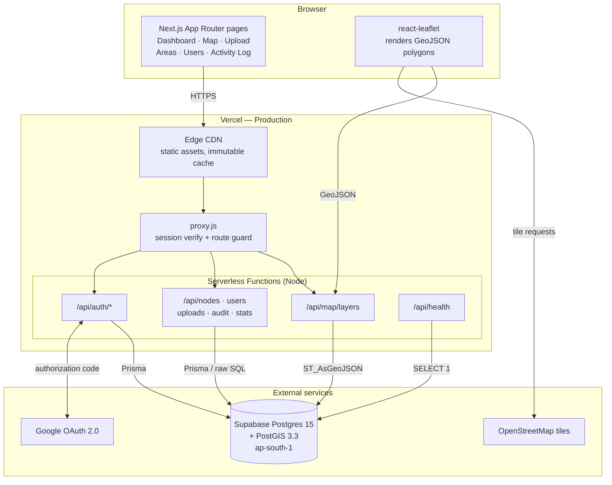
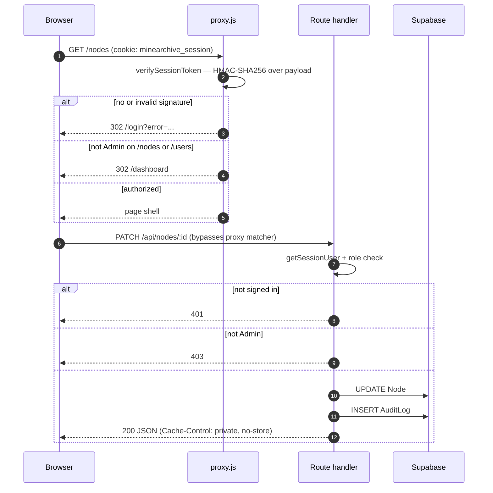
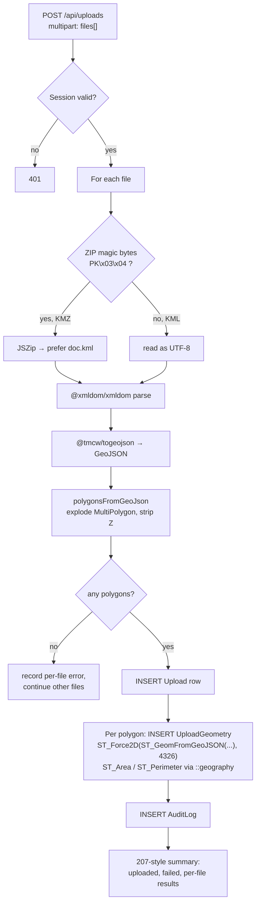
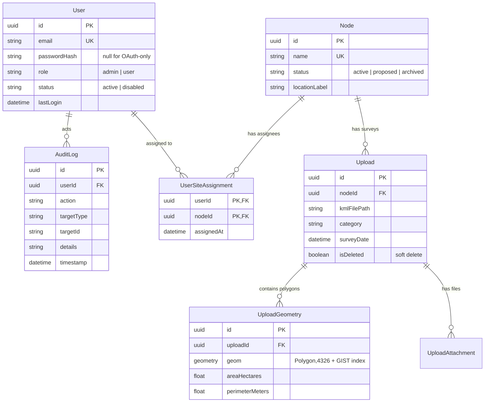
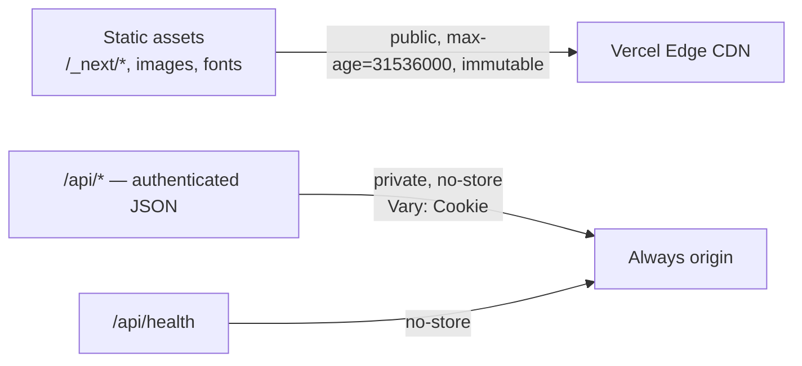
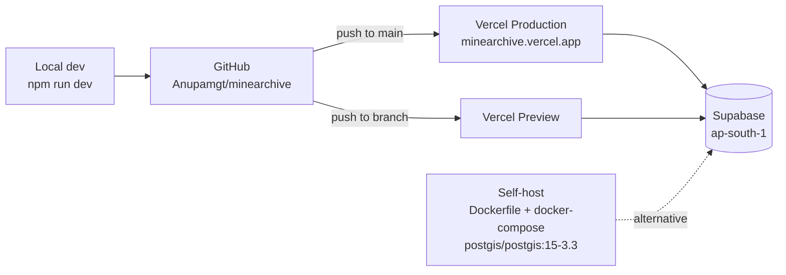

# MineArchive — System Design

Mining Area Directory & Spatial Archive. Surveyors upload KML/KMZ boundary files
for mining areas; the system stores them as PostGIS polygons, renders them on a
map, and keeps an immutable activity trail.

> Diagrams below are Mermaid, so they render inline on GitHub and stay diffable.
> PNG exports for slides live in [`docs/diagrams/`](diagrams/); regenerate them
> with `npm run docs:diagrams`.

---

## 1. Container diagram

**Why this shape.** The app is a single Next.js deployment rather than a split
frontend/backend: route handlers and pages share the same session helpers and
Prisma client, and Vercel gives per-route serverless isolation without a separate
service to operate. Postgres is the only stateful component.

---

## 2. Request lifecycle and authorization

Authorization is enforced twice, because the proxy only guards *pages*:
`proxy.js` skips `/api/*` (see its `matcher`), so every route handler re-checks
the session itself.

**Session token.** `base64url(payload) + "." + base64url(HMAC-SHA256(payload, SESSION_SECRET))`,
signed with Web Crypto so the same code runs in both the Edge proxy and Node
handlers. The payload carries `id`, `name`, `email`, `role`.

The cookie is deliberately **not** `httpOnly`: client components read the payload
to decide what UI to render. The signature is what makes this safe — a forged
`{"role":"Admin"}` cookie fails verification server-side. Every authorization
decision happens on the server; the client copy only affects presentation.

Field users are additionally scoped to the monitoring areas in
`UserSiteAssignment` (`lib/site-access.js`). Admins ignore that table and see
every site. An unassigned field user receives empty node, upload, map, and
site-activity lists — never a fallback to all sites. Enforcement is in the
Next.js APIs, not Supabase RLS.

---

## 3. KML/KMZ ingestion

The one genuinely non-trivial data path. A single request can carry several
files, and each file can contain several polygons.

Three details that were load-bearing:

- **KML altitude.** Coordinates are `lon,lat,alt` triples. The column is
  `geometry(Polygon, 4326)` — strictly 2D — so a raw insert fails with
  *"Geometry has Z dimension but column does not"*. Coordinates are flattened in
  JS and wrapped in `ST_Force2D` as a backstop.
- **Area in real units.** `ST_Area` on a 4326 geometry returns square degrees.
  Casting to `::geography` first yields square metres, divided by 10,000 for
  hectares.
- **Partial success.** One malformed file in a batch does not abort the rest;
  each file reports its own outcome.

---

## 4. Data model

Prisma cannot express PostGIS types, so `geom` is declared
`Unsupported("geometry(Polygon, 4326)")` and every read or write of it goes
through raw SQL (`$queryRawUnsafe` / `$executeRawUnsafe`) with parameter binding.
Everything else is ordinary Prisma.

Deletes are soft (`Upload.isDeleted`) and status changes are reversible, so the
archive stays audit-complete — nothing a user clicks destroys history.

---

## 5. API surface

| Method | Route | Access | Purpose |
|---|---|---|---|
| `POST` | `/api/auth/login` | public | Email + password, sets signed cookie |
| `GET` | `/api/auth/google` | public | Start OAuth, sets state cookie |
| `GET` | `/api/auth/callback/google` | public | Exchange code, upsert user |
| `GET` | `/api/stats` | signed in | Dashboard counters (field users: assigned sites only) |
| `GET` | `/api/nodes` | signed in | List monitoring areas (field users: assigned only) |
| `POST` | `/api/nodes` | admin | Create area |
| `PATCH` | `/api/nodes/[id]` | admin | Rename, archive, restore |
| `POST` | `/api/nodes/[id]/breach` | admin | Record encroachment notice |
| `GET` | `/api/uploads` | signed in | Survey history (`?nodeId=`; field users scoped) |
| `POST` | `/api/uploads` | signed in | Multi-file KML/KMZ ingest (field users: assigned node only) |
| `DELETE` | `/api/uploads/[id]` | admin | Soft-delete a boundary file |
| `GET` | `/api/map/layers` | signed in | GeoJSON FeatureCollection (field users scoped) |
| `GET` | `/api/users` | admin | List users (includes `assignedSites`) |
| `POST` | `/api/users` | admin | Create user (`assignedNodeIds`) |
| `PATCH` | `/api/users/[id]` | admin | Edit role, sites, disable, enable |
| `GET` | `/api/audit` | signed in | Activity log (admin: all; field user: assigned-site actions only) |
| `GET` | `/api/health` | public | Liveness; `?deep=1` checks DB + PostGIS |

Admin-only mutations also enforce two invariants: an admin cannot disable or
demote their own account, and the last active admin cannot be removed.

---

## 6. Caching

Authenticated responses are never CDN-cached; `Vary: Cookie` plus `private,
no-store` prevents one user's data being served to another.

The server-side Data Cache was **removed deliberately**. List queries originally
used `unstable_cache` with tag invalidation, but in Next.js 16
`revalidateTag(tag, 'max')` is stale-while-revalidate: the first read after a
write still returned stale rows, so a newly created area did not appear until a
later refresh. `updateTag` (read-your-own-writes) is only callable from Server
Actions, not route handlers. For a low-traffic admin CRUD tool, read-after-write
correctness beats a data cache, so these queries hit Postgres directly.
`lib/cache-headers.js` keeps `bustTags()` as a no-op for call-site compatibility.

---

## 7. Deployment

`next.config.mjs` sets `output: 'standalone'` **only when not on Vercel**, so the
Docker path still produces a self-contained server while Vercel uses its own
tracing.

**Connection strings.** Prisma needs two, because Supabase's transaction pooler
cannot run DDL:

| Variable | Port | Used for |
|---|---|---|
| `DATABASE_URL` | `6543` transaction pooler | Runtime queries; `pgbouncer=true&connection_limit=1` suits serverless |
| `DIRECT_URL` | `5432` session pooler | Migrations, `CREATE EXTENSION postgis` |

Note the direct `db.<ref>.supabase.co` host is IPv6-only, which many networks and
CI runners cannot reach; the regional `pooler.supabase.com` hostnames resolve to
IPv4 and are what both variables should point at.

---

## 8. Known gaps

- **Passwords are stored in plaintext** (`passwordHash` holds the raw value).
  This is MVP scaffolding and must become bcrypt/argon2 before real users.
- **Uploaded KML bytes are not retained** — only the filename and the parsed
  geometry. Supabase Storage is wired (`lib/supabase.js`) but unused.
- **No rate limiting** on `/api/auth/login`.
- **Change metrics are not computed.** Area and perimeter are stored per polygon,
  but the between-survey diff shown in the UI is not yet derived from them.
- **Supabase free tier pauses after 7 days idle**, so the first request after a
  quiet week will fail until the project resumes.
